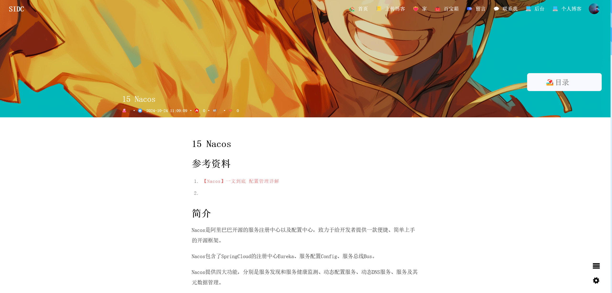
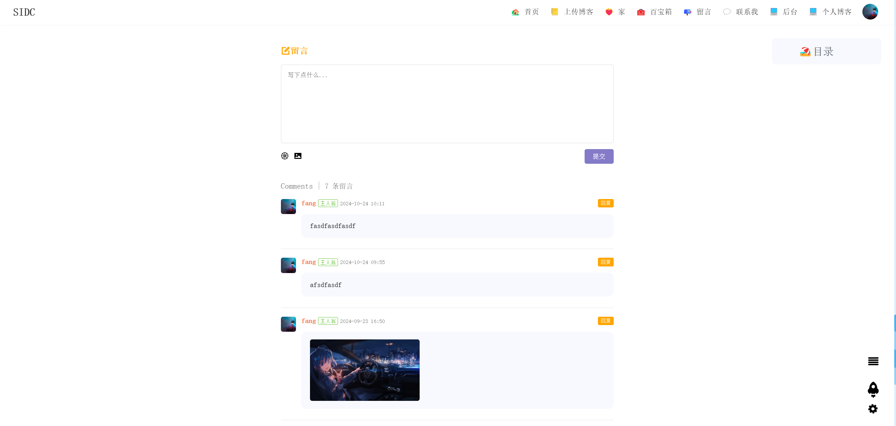
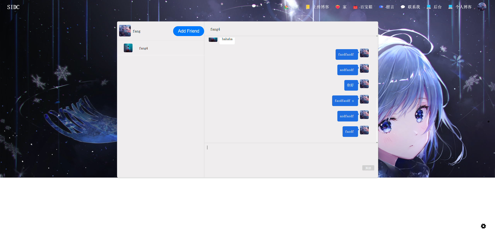
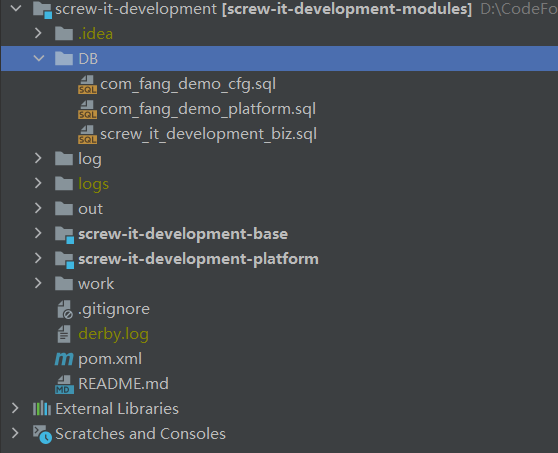
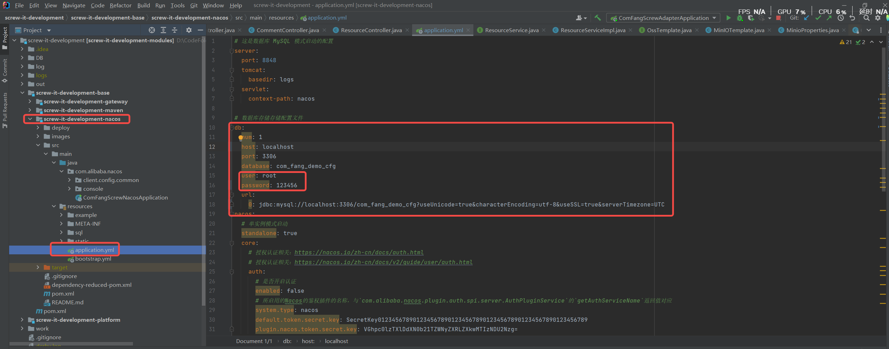
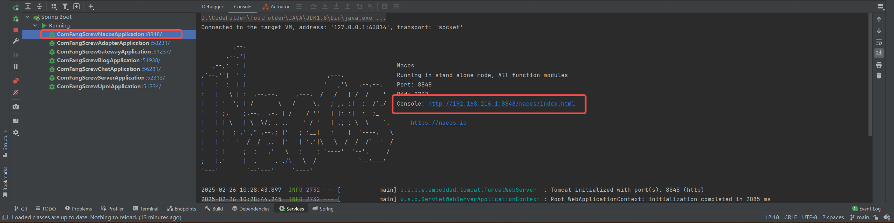
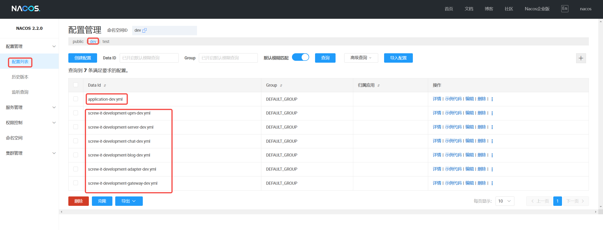
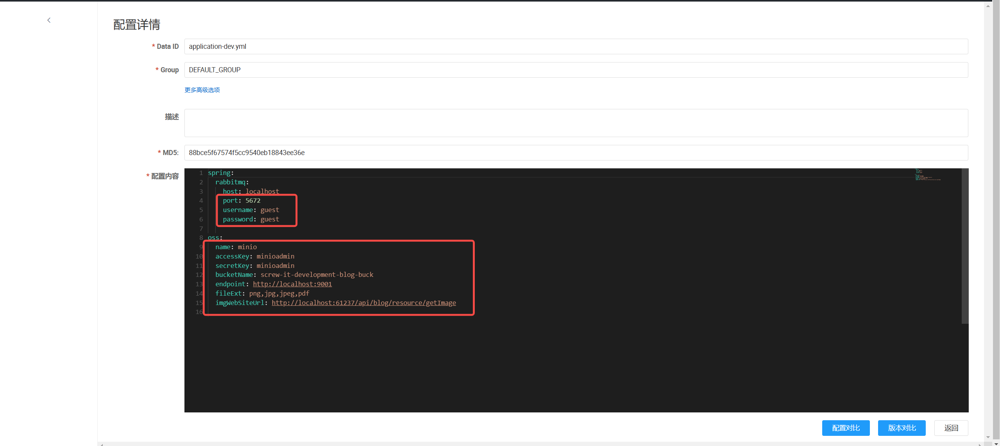
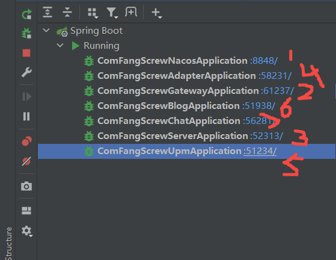

# SIDC

## 项目简介

SIDC 是一个专为技术开发者设计的博客阅读与管理平台，旨在为用户提供高效、便捷的博客创作与分享体验。与传统的博客平台（如 CSDN）相比，SIDC 在功能上进行了深度优化，特别是在博客上传与图片管理方面，极大地提升了用户的操作效率。用户可以通过 SIDC 轻松上传 Markdown 格式的博客内容，并利用其独有的 **一键图片上传功能**，自动将博客中的本地图片上传至云端，同时智能替换 Markdown 文件中的图片地址，彻底解决了传统平台需要手动逐张上传图片的繁琐问题。

此外，SIDC 还提供了丰富的社交互动功能，用户可以在平台上添加好友、私信交流，甚至通过博客留言功能与其他开发者进行深度讨论。无论是 **博客阅读**、**博客创作**，还是 **技术交流**，SIDC 都致力于为用户打造一个高效、友好的技术社区环境，帮助开发者更专注于内容创作与知识分享。

## 项目本地部署

1. 导入数据库至本地，使用的数据库是MySQL；
   
2. 然后修改如下图所示的相关本地MySQL数据库密码确保Nacos可以访问到数据库；
   
3. 启动Nacos；
   
4. 访问上图中的网址，然后修改这里面的配置，涉及到的相关配置有MySQL、Redis、RabbitMQ、MinIO等相关配置；
   
5. 如：
   
6. 然后依次启动：
   
7. 然后启动前端项目github地址为：https://github.com/fangyaohui/screw-it-development-poetize
   命令行执行npm run serve即可

